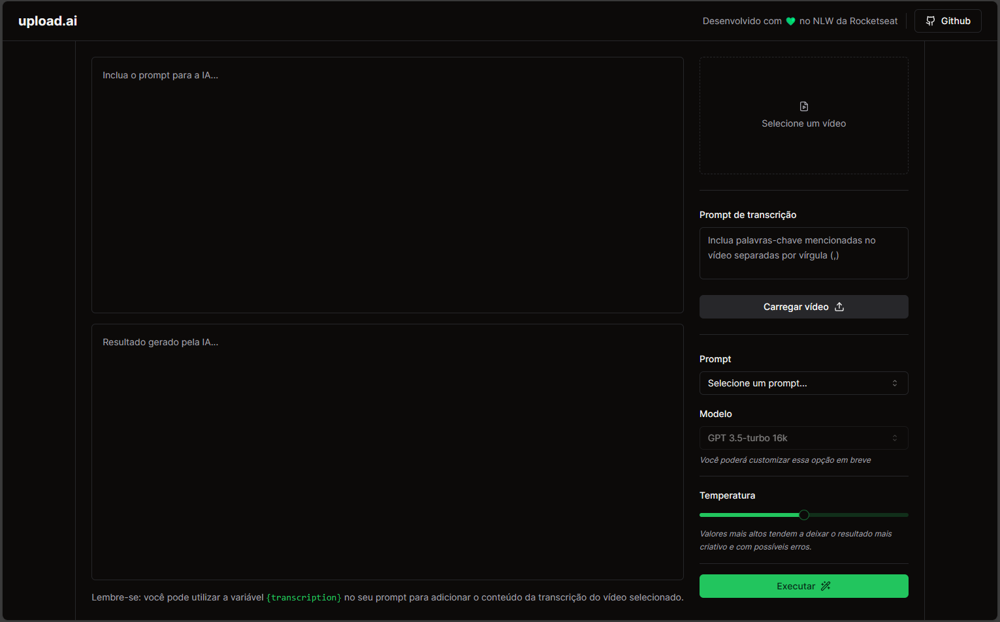

# Upload.ai

Este projeto foi desenvolvido durante o evento NLW da Rocketseat e é uma ferramenta poderosa para criação de títulos chamativos e descrições otimizadas para vídeos do YouTube, tudo com o uso de inteligência artificial.

## Funcionalidades

O Upload.ai oferece as seguintes funcionalidades:

- Conversão de Vídeo para Áudio: Utiliza IA para converter o conteúdo do vídeo em formato de áudio.
- Transcrição Automática: Gera automaticamente uma transcrição precisa do áudio.
- Prompt de Criação de Conteúdo: Oferece duas opções de prompts pré-configuradas para criar títulos e descrições atrativos.
- Personalização Fácil: Os prompts pré-configurados podem ser facilmente editados para se adequarem às suas necessidades.
- Controle de Criatividade: Permite selecionar o nível de "temperatura" da IA para ajustar a criatividade na geração de respostas.

## Como Usar

Para começar a utilizar o Upload.ai, siga estas etapas simples:

1. Clone este repositório: `git clone https://github.com/thiagop90/upload-ai.git`
2. Execute a aplicação.
3. Siga as instruções no aplicativo para converter seu vídeo em áudio, gerar transcrições e criar títulos e descrições impressionantes para seus vídeos do YouTube.

## Contribuição

Este projeto está aberto para contribuições. Sinta-se à vontade para criar pull requests e relatar problemas para melhorar o Upload.ai.

Desenvolvido com ❤️ por [thiagop90](https://github.com/thiagop90)
